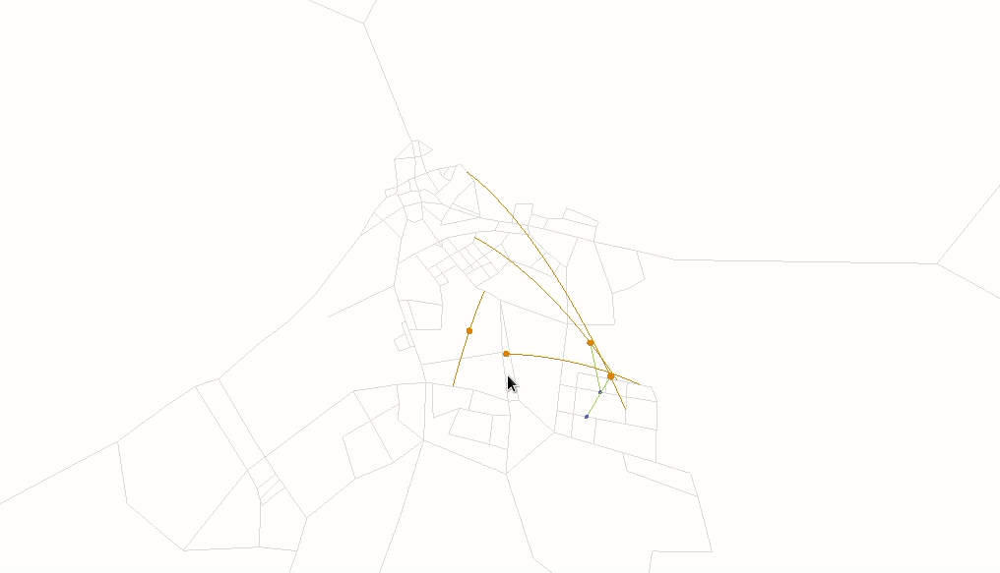

# drtviz

This repository contains visualisation tools for MATSim's DRT contribution and related projects (such as AMoDeus).



[Click here for a demo for the Open Berlin scenario](https://www.youtube.com/watch?v=ZNbW-7OQ7SY)

## User Guide

As a user, you have two options. Either you download a jar release that is available on Github, or you build a recent jar from the master branch on your own. In any case, you running the visualisation is easy once you have obtained the jar. Here is an example:

```
java -jar drtviz-*.jar --network-path output_network.xml.gz --events-path output_events.xml.gz
```

Replace `output_network.xml.gz` and `output_events.xml.gz` with the paths to your generated DRT MATSim output. Once you start the JAR the visualiser starts to process. Note that you can already watch the visualisation while loading (only up to the point the data has been processed; *remark: actually, only works theoretically because of concurrent access for the time being*). To do so, open your browser and go to

`http://localhost:9000`

You should see the visualisation now.

If your port `9000` is already running another service you can specify another port by adding
`--port 9050` or similar to the command line.

### Building a recent jar

To do so, clone this repository and call

`mvn package`

in the repository directory. The process of building and packaging the frontend made of `Vue.js` and `Three.js` is automated with a smart Maven plugin. *(Maven will install Node.js and yarn to do so, this seems to work well on Linux, but not tested on Mac/Windows. Feedback welcome!!)*. After, you should find a built jar in

`target/drtviz-*.jar`

This is runnable jar that can be executed as described above.

## Developer Guide

*Disclaimer: Everything is quite rough right now, soon this needs a good clean-up, especially on the frontend side!*

When developing, it is cumbersome to let Maven handle the building of the frontend
(especially when you make changes to the frontend). Therefore, make sure you have
Node.js installed as well as `yarn` which handles the JavaScript dependency
management. If both are installed, go to `/frontend` and execute

```
yarn serve
```

This should install all the dependencies if they are not already available
and start a web server at port `8080`. You can then access the frontend at

```
http://localhost:8080
```

At any time in parallel you can start the visualiser (which will be started
on port `9000`), for instance by running `RunVisualisation` in Eclipse or IntelliJ.
If you refresh the website at `8080` the frontend will query
the visualisation server to get information to display. Now you can easily
change files in `/frontend` and the updated will be available as soon as you
refresh the browser window. Likewise, you can start and stop the server to
test and make changes at any time.

*Note that currently this works, because there is a default CORS exception
configured for the Javalin web server, otherwise one would not be able to
connect from something running on port 8080 to 9000. We should find a more
secure solution later on.*
